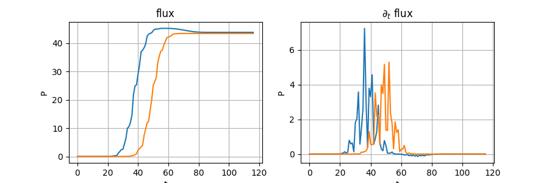

# meep_mod

这是一个基于[meep](https://github.com/NanoComp/meep)的ui修改，在这里我根据一些主流的仿真软件使用习惯提供了一套模块化的模型构建方案。

## 安装
### 本地pip安装
可以直接pip安装本地包：
- 下载文件 或者 git到本地 
- 后在本项目根目录内 ```pip install .```
### 配置环境
或者如果你想手动配置运行环境：
- [安装 meep 环境](https://meep.readthedocs.io/en/latest/Installation/) \
```conda create -n mp -c conda-forge pymeep pymeep-extras```

- 或者 MPI+meep： \
```conda create -n pmp -c conda-forge pymeep=*=mpi_mpich_*```

- 下载 meep_mod
直接下载文件 或者 git到本地，放在项目路径中。

- 安装可视化环境
在这里的例子中，使用了一些常用的package完成数据可视化。 \
[jupyter lab](https://jupyter.org/) ``` pip install jupyterlab``` \
[matplotlib](https://matplotlib.org/) ``` pip install matplotlib``` \
[pandas](https://pandas.pydata.org/) ``` pip install pandas``` \
[vega-altair](https://altair-viz.github.io/) ``` pip install altair vega_datasets```

### 导入meep_mod
```
import meep as mp
import meep_mod.mod as mod
from meep_mod.gallary import *
```

## UI 说明
meep_mod提供的的ui结构如下（以FDTD求解器为例）：\


在meep中，FDTD求解器为mp.Simulation类。其包含Geometry,Boundary,Source等模型信息与DftMonitor, VolumeMonitor两种结果测量。时间域算法中求解器时间演化中的额外操作由step function定义。

在meep_mod中，我们将模型的构建划分为 **全局参数、几何、激励、研究** 几个模块。为实现各层面的独立定义、检验与自由组合，我们需要定义一系列不同层级的节点，其以独立的脚本文件的形式实现。其中最基础的节点为**对应实体的脚本**（mod.GeoScript, mod.SrcScript, mod.MonScript, ...）这种脚本定义了一个相应的类，它们接收参数输入，然后由对应的create方法生成需要的几何、激励、监视器等实体。模型的几何与激励模块即由相应的脚本组成。而**研究节点**（mod.FDTDStudy, mod.ModeStudy）则相对复杂，一个研究应包含一组监视器、一组step func以在需要的时间序列上保存所需数据，以及对应的数据空间。同时需要包含至少一个run方法以接入求解器运行模拟，以及一个ouput方法以完成对数据的保存。最后，一个完整的**模型节点**（mod.Model）将包含以上所有需要的子模块。在模型节点中，我们会定义所有需要的全局参数（自变量），并计算得到所有的应变量输入子模块。

我们在meep_mod.gallery.monitor_/mod.gallery.study_中提供了一些基础的MonScript/Study。

## 运行环境
在meep_mod中，我们提供了一些方法以帮助检查当前运行环境（单线程/集群，是否兼容可视化等），并提供了相应修饰器（见meep_mode/mod/env.py）。

## 输入与输出
在meep_mod中，我们提供了output_h5/read_h5方法以完成.h5格式的数据输入输出，其中output_h5方法将一个python object的所有信息尽可能地以合适的形式写入.h5而read_h5方法以返回一个类似hdf5格式的字典见（meep_mode/mod/io.py）。这些方法已考虑MPI兼容。


## 构建一个模型
下面我们使用meep_mod构建一个线性渐变平面波导（taper）的io模型。

项目文件结构如下
```
- test_project  # 主目录，各种模拟与分析
  io.py
  io_scan.py
  visualization.py
-- model  # 各节点定义文件
   __init__.py
   model.py
   geo_wg_.py
   fdtdstudy_io_.py
```

### 几何：波导
首先我们编写几何脚本（test_project/model/geo_wg_.py）。这里的几何比较简单，包含一个线性波导和一个可选的衬底。
```
"""test_project/model/geo_wg_.py"""

import meep as mp
import meep_mod.mod as mod


class Geo_wg_(mod.GeoScript):
    def __init__(self, model,
                 wg_l, wg_h, wg_w0, wg_w1, wg_center, wg_material,
                 sub_size=None, sub_material=None):
        super(Geo_wg_, self).__init__(model)
        # ---------- locals ----------
        # ---- geo.jpg parameters ---
        self.wg_l = wg_l  # waveguide
        self.wg_h = wg_h
        self.wg_w0 = wg_w0
        self.wg_w1 = wg_w1
        self.wg_center = wg_center

        self._v1 = wg_center + mp.Vector3(-wg_l/2,-wg_w0/2,-wg_h/2)
        self._v2 = wg_center + mp.Vector3(-wg_l/2,+wg_w0/2,-wg_h/2)
        self._v3 = wg_center + mp.Vector3(wg_l/2,+wg_w1/2,-wg_h/2)
        self._v4 = wg_center + mp.Vector3(wg_l/2,-wg_w1/2,-wg_h/2)

        self.sub_size = sub_size  # substrate
        if self.sub_size is not None:
            self.sub_center = mp.Vector3(wg_center.x, wg_center.y, wg_center.z-(wg_h+sub_size.z)/2)

        # --- material ---
        self.wg_material = wg_material
        self.sub_material = sub_material

    def create_geometry(self):
        wg = [mp.Prism([self._v1, self._v2, self._v3, self._v4],
                       height=self.wg_h, axis=mp.Vector3(0,0,1),
                       material=self.wg_material)]
        if self.sub_size is not None and self.sub_material is not None:
            sub = [mp.Block(size=self.sub_size, center=self.sub_center, material=self.sub_material)]
        else:
            sub = []
        return wg+sub
```

我们可以在该文件中添加__main__来直接测试这个几何脚本
```
...

if __name__ == '__main__' and mod.is_matplotlib_available():  # test
    import matplotlib.pyplot as plt

    wg_ = Geo_wg_(None,
                  wg_l=5, wg_h=0.22, wg_w0=1.5, wg_w1=0.7, wg_center=mp.Vector3(), wg_material=mp.Medium(epsilon=12),
                  sub_size=mp.Vector3(5,3,2), sub_material=mp.Medium(epsilon=3))

    sim = mp.Simulation(resolution=10, cell_size=mp.Vector3(5,2,3))
    sim.geometry = wg_.create_geometry()

    fig, axs = plt.subplots(3,1)
    mod.plot2D(sim, fig, axs[0], output_plane=mod.center_plane(sim.cell_size, ax='z'))
    mod.plot2D(sim, fig, axs[1], output_plane=mod.center_plane(sim.cell_size, ax='x'))
    mod.plot2D(sim, fig, axs[2], output_plane=mod.center_plane(sim.cell_size, ax='y'))
    plt.show()
```


### 研究：流量
接下来我们编写研究脚本（test_project/model/geo_wg_.py），实现对多个传感器的时间-流量检测。这是一个FDTD研究，继承meep_mod.gallary.StdStudy_FDTD_类。

在这个研究里，我们利用step func记录所有流量传感器fluxes_的全时间域流量，保存在本study的数据空间中。
```
"""test_project/model/fdtdstudy_flux_.py"""

import meep as mp
import meep_mod.mod as mod
from meep_mod.gallery.study_ import StdStudy_FDTD_


class FDTDStudy_Flux_(StdStudy_FDTD_):
    def __init__(self, model, fluxes_, dt=mp.inf, **kwargs):
        super(FDTDStudy_Flux_, self).__init__(model, dft_monitors_=fluxes_, **kwargs)
        # ---------- locals ----------
        # --- monitors ---
        self.dt = dt
        # --- data ---
        self.fluxes_history = None
        self.fluxes_freq = None
        self.t = None

```
step func 包括：记录时间、记录流量、数据格式转换
```
...

    def _create_step_funs(self):
        """ run after ._create_dfts() """
        # create empty data spaces
        self.fluxes_history = []
        self.fluxes_freq = []
        self.t = []
        # create step funcs
        append_flux = []
        append_t = []
        convert_nd_data = []
        for i, flux in enumerate(self._dfts):
            self.fluxes_history.append([])
            self.fluxes_freq.append(mp.get_flux_freqs(flux))

            append_flux += [mp.at_every(self.dt, mod.append_flux(flux, self.fluxes_history[i]))]
            append_flux += [mp.at_end(mod.append_flux(flux, self.fluxes_history[i]))]

        append_t += [mp.at_every(self.dt, mod.append_sim_t(self.t))]
        append_t += [mp.at_end(mod.append_sim_t(self.t))]

        convert_nd_data += [mp.at_end(mod.lists2ndarrays(self, ["fluxes_history", "t", "fluxes_freq"]))]

        self._step_funcs = append_flux + append_t + convert_nd_data
        return self._step_funcs
```
最终接入求解器mp.Simulatuion的 run_study方法需要实现：\
创建一个路径以保存结果、在求解器中创建所有的流量/体积监视器、创建step func并带入求解器 \
最后运行求解器。
```
...

    def run_study(self, sim: mp.Simulation, output_field=False, **kwargs):
        self._create_dir()
        self._create_dfts(sim)
        self._create_vols()
        self._create_step_funs()

        if output_field:
            sim.filename_prefix = self._runtime_dir + '/' + 'field'  # overwrite output dir of sim
            self._step_funcs += [mp.at_every(self.dt, mp.output_efield)]

        mp.Simulation.run(sim,
                          *self._step_funcs,
                          **kwargs)


```

### 源：本征
在这个模型中源比较简单，只需要波导截面上的本征模式激励即可。直接使用meep的相应源。

### 传感器：流量
传感器为flux传感器，直接使用meep_mod.gallary.Flux_类。

### 完整模型
现在我们可以编写完整模型了（test_project/model/model.py）。在这里我们将拼装上面写好的所有组件，并以我们想要的关系将他们组合起来。

```
"""test_project/model/model.py"""

import numpy as np

import meep as mp
import meep_mod.mod as mod
try:
    from .fdtdstudy_flux_ import FDTDStudy_Flux_
    from .geo_wg_ import Geo_wg_
except:
    from fdtdstudy_flux_ import FDTDStudy_Flux_
    from geo_wg_ import Geo_wg_  # solve problems for directly running model.py
from meep_mod.gallery import StdMon_Flux_
```
模型本体为一个mod.Model类。首先我们定义全局参数与参数的外部接口。通常来说全局参数包括模型解析度、基本的几何数据（长宽高）、全局频率等。利用这些参数我们先计算好下面需要用的所有应变量数据。
```
...

class MainModel(mod.Model):
    def __init__(self,
                 resolution=20,
                 f_cen=0.66, f_width=0.1, f_num=3,
                 wg_l=5, wg_h=0.22, wg_w0=5, wg_w1=0.7,
                 pad_size=mp.Vector3(0, 2, 2), pml_width=0.5,
                 src2pml=mp.Vector3(0.5), mon2pml=mp.Vector3(1),
                 symmetries=[],
                 dt=5,
                 output_dir="./data",
                 _n=None):
        super(MainModel, self).__init__()
        self._n = _n
        # --------- global parameters ----------
        # --- resolution ---
        self.resolution = resolution

        # --- geometry ---
        self.wg_l = wg_l  # wg
        self.wg_h = wg_h
        self.wg_w0, self.wg_w1 = wg_w0, wg_w1
        self.pad_size = pad_size

        self.src2pml = src2pml
        self.mon2pml = mon2pml

        self.cell_size = mp.Vector3(self.wg_l,
                                    max(self.wg_w0, self.wg_w1),
                                    self.wg_h) + self.pad_size * 2          # sim cell

        self.pml_width = pml_width

        self.src_pt = mp.Vector3(-self.cell_size.x/2+self.pad_size.x+self.src2pml.x)
        self.mon_pt = mp.Vector3(-self.cell_size.x/2 + self.pad_size.x + self.mon2pml.x)

        self.src_size = mp.Vector3(0, self.wg_w0, self.wg_h) + mp.Vector3(0,0.5,0.5)
        self.mon_size0 = self.src_size
        self.mon_size1 = mp.Vector3(0, self.wg_w1, self.wg_h) + mp.Vector3(0,1,0.5)

        # --- parity ---
        self.symmetries = symmetries

        # --- frequency  ---
        self.f_cen = f_cen
        self.f_width = f_width
        self.f_num = f_num

        # --- time step ---
        self.dt = dt

        # --- output homedir ---
        self.output_dir = output_dir
```
定义材料
```
...

        # ---------- material ----------
        self.Air = mp.Medium(epsilon=1)
        self.Si = mp.Medium(epsilon=12.087)
```
最后利用参数生成各个组件
- 几何
```
...
        #  ---------- geometry ----------
        self.geometry_ = Geo_wg_(self,
                                 wg_l=self.wg_l, wg_h=self.wg_h, wg_w0=self.wg_w0, wg_w1=self.wg_w1, wg_center=mp.Vector3(),
                                 wg_material=self.Si)
```
- 边界条件
```
...
        # ---------- boundary ----------
        self.pmls = [mp.PML(self.pml_width)]

```
- 源
``` 
...
       # ---------- src ----------
        self.eigen_src = [mp.EigenModeSource(mp.GaussianSource(frequency=self.f_cen, fwidth=1.5 * self.f_width),
                                             volume=mp.Volume(center=self.src_pt, size=self.src_size))]
```
- 监视器
```
...
        # ---------- monitor ----------
        self.fluxs_ = [StdMon_Flux_(self, center=self.mon_pt, size=self.mon_size0,
                                    f_cen=self.f_cen,
                                    f_width=self.f_width,
                                    n_freq=self.f_num)]  # flux i
        self.fluxs_ += [StdMon_Flux_(self, center=-1*self.mon_pt, size=self.mon_size1,
                                     f_cen=self.f_cen,
                                     f_width=self.f_width,
                                     n_freq=self.f_num)]  # flux o
```
- 求解器
```
...
        # --------- simulation ----------
        #   --- sim obj ---
        self.sim = mp.Simulation(cell_size=self.cell_size, resolution=self.resolution,
                                 sources=self.eigen_src,
                                 boundary_layers=self.pmls,
                                 symmetries=self.symmetries,
                                 geometry=self.geometry_.create_geometry())
```
- 研究
```
...
        # ---------- study ----------
        self.FDTD_flux_ = FDTDStudy_Flux_(self, fluxes_=self.fluxs_, dt=dt, _n=self._n, output_dir=self.output_dir)
```
我们可以在该文件中添加__main__来直接测可视化这个模型
```
...

if __name__ == '__main__':
    model = MainModel(symmetries=[mp.Mirror(mp.Y, phase=-1), mp.Mirror(mp.Z, phase=1)])

    study = model.FDTD_flux_
    sim = model.sim
    study.plot2D(sim)
```
 


### 引用model
```
"""test_project/model/__init__.py"""

from .model import *
from .fdtdstudy_flux_ import *
from .geo_wg_ import *
```

### 运行一个模拟
在项目根目录下建立一个模拟（test_project/io.py），计算一个线性渐变波导的IO损耗，将结果保存到test_project/data中。
```
"""test_project/io.py"""

import meep as mp

import sys
sys.path.append("../..")  # help finding meep_mod
import meep_mod.mod as mod
from model import MainModel

mod.new_dir('data')

model = MainModel(symmetries=[mp.Mirror(mp.Y, phase=-1), mp.Mirror(mp.Z, phase=1)], dt=1)

study = model.FDTD_flux_
sim = model.sim

study.run_study(sim, output_field=False, until_after_sources=50)
study.output_result()
```

### 分析数据
meep_mod提供了read_h5方法读取数据。\
下面的一个例子分析了输入与输出监视器能流&单位时间能流，并计算了效率。
```
"""visualization"""

import numpy as np
import matplotlib.pyplot as plt
import meep_mod.mod as mod 

study_dirname = "sample/test_project/data/xxxxx"  # 结果文件夹
filename = study_dirname + "/result/model.h5"
result = mod.read_h5(filename)

fluxes = result['FDTD_flux_']['fluxes_history']
freqs = result['FDTD_flux_']['fluxes_freq']
t = result['FDTD_flux_']['t']

dfluxes_dt = fluxes[:,1:,1]-fluxes[:,:-1,1]

fig = plt.figure(figsize=[9,3])
axs = fig.subplots(1,2)
ax=axs[0]
ax.plot(fluxes[:,:,1].transpose())
ax.set_title('flux')
ax.set_xlabel('t')
ax.set_ylabel('P')
ax.grid(True)
ax=axs[1]
ax.plot(dfluxes_dt.transpose())
ax.set_title('$\partial_t$ flux')
ax.set_xlabel('t')
ax.set_ylabel('P')
ax.grid(True)
plt.show()

print('eta=',max(fluxes[1,:,1])/max(fluxes[0,:,1]))
```


### 参数扫描
在项目根目录下建立一个扫描（test_project/io_scan.py），扫描不同波导长度的模型的IO损耗，将结果保存到test_project/data/scan_xxxx中。
```
"""test_project/io_scan.py"""

import meep as mp

import sys
sys.path.append("../..")  # help finding meep_mod
import meep_mod.mod as mod
from model import MainModel

mod.new_dir('data')
now = mod.get_time()
scan_dir = mod.new_dir('./data/scan_'+now)

for i, wg_l in enumerate([5,10,20]):
    model = MainModel(wg_l=wg_l,
                      symmetries=[mp.Mirror(mp.Y, phase=-1), mp.Mirror(mp.Z, phase=1)], dt=1,
                      output_dir=scan_dir, _n=i)

    study = model.FDTD_flux_
    sim = model.sim

    study.run_study(sim, output_field=False, until_after_sources=80)
    study.output_result()
```
结果如下，长度越大taper效率越高\


## 更多案例
./sample文件夹下提供了一个分析硅基一维光子晶体腔的案例（*待补全*），详细说明参见[sample.ipynb](sample.ipynb)
